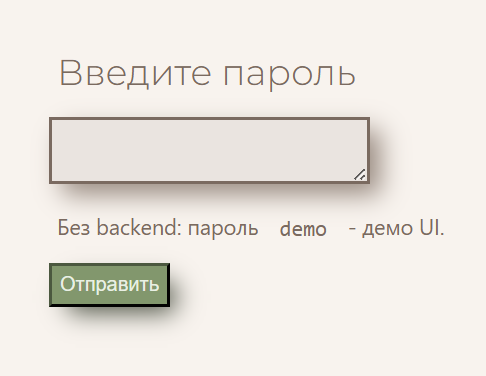
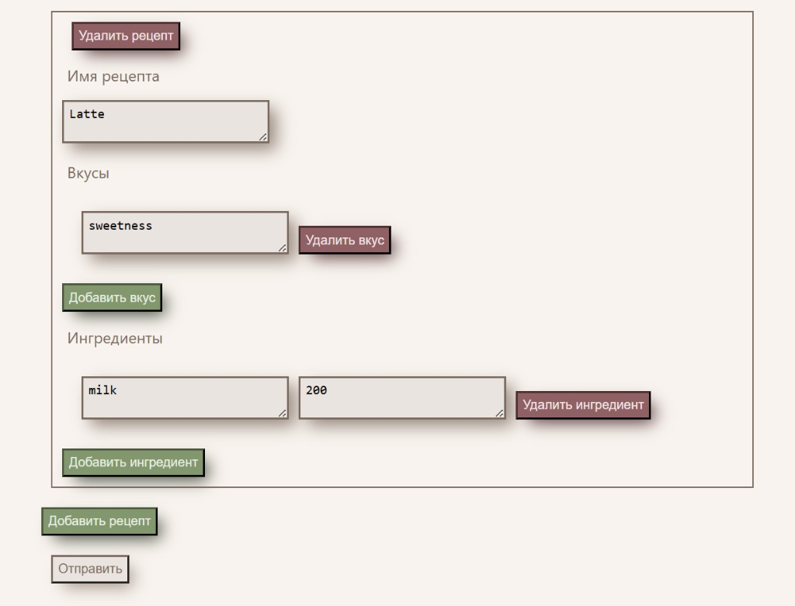
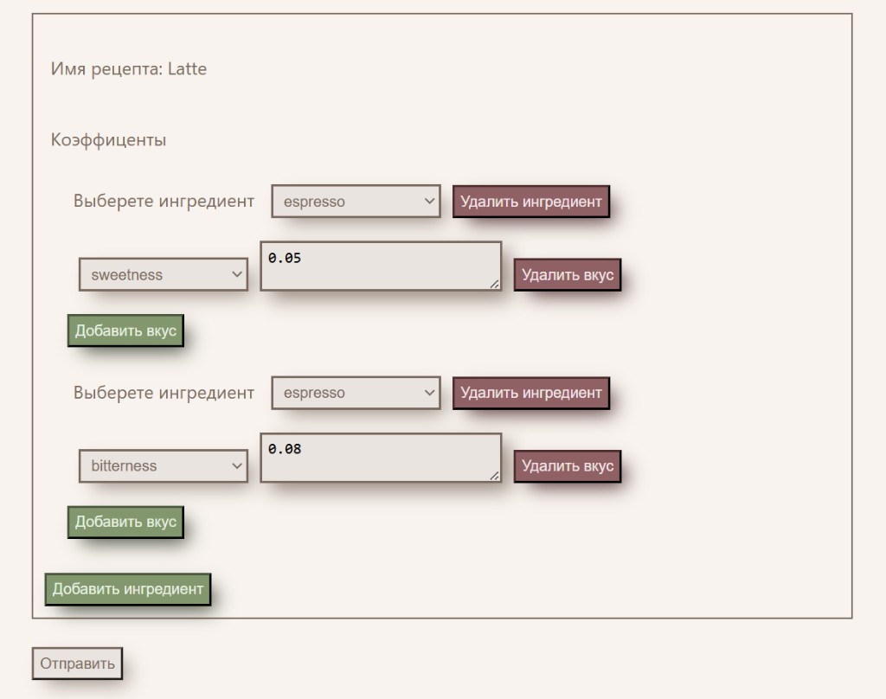

<h1 align="center">Balance Business</h1>

<p align="center">
  <b>Бизнес-панель для проекта Balance</b><br/>
  <i>Business panel for recipe & taste coefficients in the Balance project</i>
</p>

<p align="center">
  Редактор рецептов · коэффициенты влияния · персонализация вкуса
</p>

<p align="center">
  
  
  
  
  
</p>

---

## О проекте

**Balance Business** — веб-панель для менеджера в проекте [Balance](https://github.com/Shfdis/balance): здесь собирают «умные» рецепты, базовые ингредиенты и правила влияния на вкусы.

Гость после покупки может пройти опрос ([balance-survey](https://github.com/Ariabochkina/balance-survey)) и сдвинуть вкус — а следующий заказ готовится уже с учётом предпочтений. Эта панель задаёт ту конфигурацию, от которой зависит персонализация.

| | |
| --- | --- |
| **Роль** | бизнес-панель (редактор рецептов и коэффициентов) |
| **Стек** | React (CRA), React Router, JavaScript, Fetch API, CSS |
| **Backend** | [Shfdis/balance](https://github.com/Shfdis/balance) |
| **Пара** | форма опроса — [balance-survey](https://github.com/Ariabochkina/balance-survey) |

---

## Скриншоты

<p align="center">
  
  &nbsp;
  
  &nbsp;
  
</p>

<p align="center">
  <em>Вход · рецепты · коэффициенты</em>
</p>

---

## Что делает приложение

1. **Вход (`/login`)** — проверка пароля и доступ к панели.
2. **Редактор рецептов (`/home`)** — создание и правка рецептов: название, вкусы, базовые ингредиенты.
3. **Редактор коэффициентов (`/coef`)** — настройка, как ингредиенты влияют на вкусы.

---

## Как это стыкуется с backend

```text
Менеджер открывает панель
  /login → /home → /coef
        │
        ▼
┌──────────────────────────────┐
│  balance-business (панель)   │
└──────────┬───────────────────┘
           │ GET  /recipes?password=...
           │ POST /recipes?password=...
           ▼
┌──────────────────────────────┐
│  balance (Flask)             │  хранит рецепты и коэффициенты
└──────────────────────────────┘
```

Формат рецепта при обмене с API:

```json
{
  "id": 0,
  "name": "Latte",
  "tastes": [
    { "id": 0, "name": "sweetness" }
  ],
  "default_ingredients": [
    { "id": 0, "name": "milk", "value": 200 }
  ],
  "change_coefficients": [
    {
      "id": 0,
      "name": "milk",
      "tastes": [
        { "id": 0, "name": "sweetness", "value": 0.05 }
      ]
    }
  ]
}
```

---

## Моя зона ответственности в этом проекте

- разработка UI бизнес-панели на React;
- декомпозиция на компоненты (`Recipe`, `Taste`, `Ingredients`, `RecipeCoefs`, `Coeficients`, `TasteCoefs`);
- экраны входа, редактора рецептов и коэффициентов;
- интеграция с API backend (`GET/POST /recipes`);
- визуальное оформление панели.

---

## Технологии

- React (Create React App)
- React Router
- JavaScript (class components)
- Fetch API
- CSS (Google Fonts — Montserrat)

---

## Структура проекта

```text
src/
├── App.js                    # маршруты /login, /home, /coef
├── demoRecipes.js            # демо-данные без backend
├── index.js
├── index.css                 # тема панели
├── Pages/
│   ├── loginPage.js          # экран входа
│   ├── Home.js               # редактор рецептов
│   └── Coef.js               # редактор коэффициентов
└── Components/
    ├── Recipe.js
    ├── Taste.js
    ├── Ingredients.js
    ├── RecipeCoefs.js
    ├── Coeficients.js
    └── TasteCoefs.js
```

---

## Локальный запуск

Нужны Node.js и npm.

### 1) Установить зависимости

```bash
npm install --legacy-peer-deps
```

(`--legacy-peer-deps` нужен из‑за React 19 и старых testing-библиотек в CRA.)

### 2) Запустить панель

```bash
npm start
```

Откроется [http://127.0.0.1:3000](http://127.0.0.1:3000) (редирект на `/login`).

**Только посмотреть UI** — на экране входа укажите пароль `demo` (или оставьте поле пустым): откроется демо-рецепт Latte. Сохранение покажет alert и не ходит на backend.

**Полный сценарий с backend** — поднимите [balance](https://github.com/Shfdis/balance) (API на `http://localhost:5000`) и войдите с паролем бизнеса:

```text
http://127.0.0.1:3000/login
```

Если API на другом адресе — поменяйте `APIUrl` в `src/App.js`.

> В монорепозитории [Shfdis/balance](https://github.com/Shfdis/balance) эта панель по-прежнему лежит в папке `frontend2` (порт `3002`) — так устроен Docker-деплой. Этот репозиторий — отдельная клиентская часть для портфолио.

---

## Ссылки

- Backend: [Shfdis/balance](https://github.com/Shfdis/balance)
- Форма опроса: [Ariabochkina/balance-survey](https://github.com/Ariabochkina/balance-survey)
- Демонстрация Balance: [Яндекс.Диск](https://disk.yandex.ru/i/mr6iN2WnrF1sFg)
